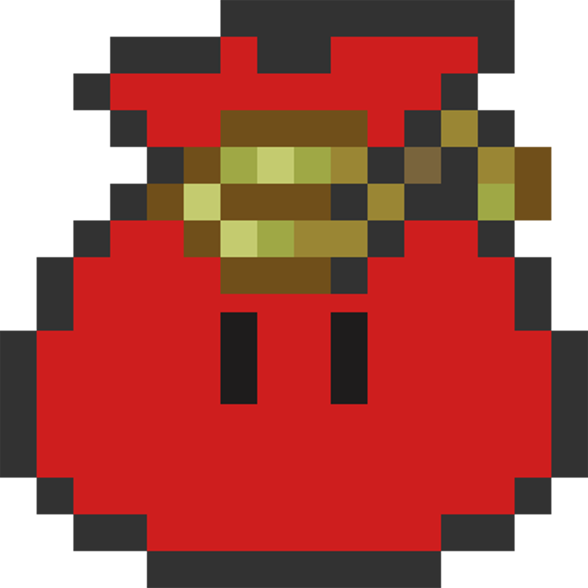
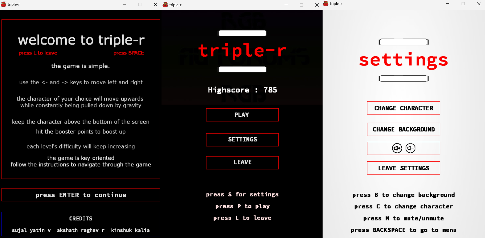
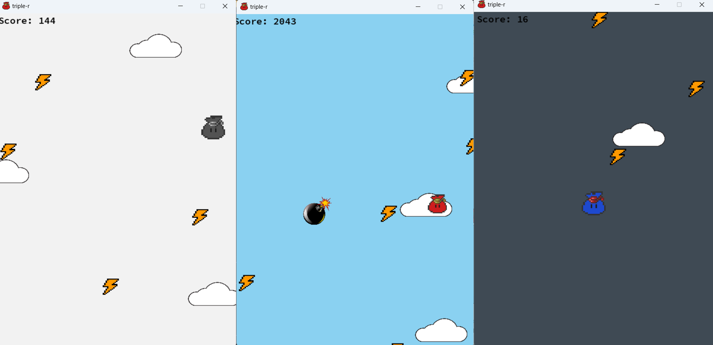

---

<!-- PROJECT SHIELDS -->
[![Contributors][contributors-shield]][contributors-url]
[![Forks][forks-shield]][forks-url]
[![Stargazers][stars-shield]][stars-url]
[![Issues][issues-shield]][issues-url]
[![MIT License][license-shield]][license-url]
[![LinkedIn][linkedin-shield]][linkedin-url]

<!-- PROJECT LOGO -->
<br />
<div align="center">
  <a href="https://github.com/sujalvaidya/triple-r">
    
  </a>

  <h3 align="center">Triple-R</h3>

  <p align="center">
    A simple yet engaging platformer game inspired by the motto "Reach High, Reach Out, Reach Beyond."
    <br />
    <a href="https://github.com/sujalvaidya/triple-r/issues/new?labels=bug&template=bug-report---.md">Report Bug</a>
    ·
    <a href="https://github.com/sujalvaidya/triple-r/issues/new?labels=enhancement&template=feature-request---.md">Request Feature</a>
  </p>
</div>

<!-- TABLE OF CONTENTS -->
<details>
  <summary>Table of Contents</summary>
  <ol>
    <li>
      <a href="#about-the-project">About The Project</a>
      <ul>
        <li><a href="#built-with">Built With</a></li>
      </ul>
    </li>
    <li>
      <a href="#getting-started">Getting Started</a>
      <ul>
        <li><a href="#prerequisites">Prerequisites</a></li>
        <li><a href="#installation">Installation</a></li>
      </ul>
    </li>
    <li><a href="#usage">Usage</a></li>
    <li><a href="#roadmap">Roadmap</a></li>
    <li><a href="#contributing">Contributing</a></li>
    <li><a href="#license">License</a></li>
    <li><a href="#contact">Contact</a></li>
    <li><a href="#acknowledgments">Acknowledgments</a></li>
  </ol>
</details>

<!-- ABOUT THE PROJECT -->
## About The Project

[![Product Name Screen Shot][product-screenshot]](https://github.com/sujalvaidya/triple-r)

**Triple-R** is an exciting game where you control a sprite aiming to "Reach High, Reach Out, Reach Beyond." This game was inspired by my high school's motto and was my first venture into game development using **Pygame**.

In **Triple-R**, players must use the left and right arrow keys to move, while gravity constantly pulls them down. Your goal is to collect lightning bolts, which help you negate the effect of gravity and reach higher!

### Features:
- Simple and intuitive controls.
- Five distinct levels, each with unique challenges:
  - **Level 1**: Regular gameplay, a great introduction.
  - **Level 2 - Saturn**: Increased gravity makes it tougher.
  - **Level 3 - Flash**: Lightning bolts flash, making them harder to collect.
  - **Level 4 - Invert**: Left and right controls are inverted, increasing difficulty.
  - **Level 5 - Bombs**: Dodge bombs as you try to reach higher!

The game also features pleasant background music and visual effects to enhance the overall experience.

<p align="right">(<a href="#readme-top">back to top</a>)</p>

### Built With
* [![Python][Python]][Python-url]
* [![Pygame][Pygame]][Pygame-url]

<p align="right">(<a href="#readme-top">back to top</a>)</p>

<!-- GETTING STARTED -->
## Getting Started

To play **Triple-R** locally, follow these instructions.

### Prerequisites

Ensure you have Python and Pygame installed:
* Python
  ```sh
  sudo apt-get install python3
  ```
* Pygame
  ```sh
  pip install pygame
  ```

### Installation

1. Clone the repository:
   ```sh
   git clone https://github.com/sujalvaidya/triple-r.git
   ```
2. Navigate to the project directory:
   ```sh
   cd code
   ```
3. Run the game:
   ```sh
   python3 tripler.py
   ```

<p align="right">(<a href="#readme-top">back to top</a>)</p>

<!-- USAGE EXAMPLES -->
## Usage

Once you start the game, use the left and right arrow keys to move your sprite. Your goal is to collect as many lightning bolts as possible to counteract gravity and reach new heights. Be wary of different levels that introduce new challenges—such as increased gravity, flashing obstacles, or inverted controls!

Here are a few screenshots from the game:






Have fun reaching high, reaching out, and reaching beyond!

<p align="right">(<a href="#readme-top">back to top</a>)</p>


See the [open issues](https://github.com/sujalvaidya/triple-r/issues) for a complete list of proposed features and known issues.

<p align="right">(<a href="#readme-top">back to top</a>)</p>

<!-- CONTRIBUTING -->
## Contributing

If you have suggestions to improve this game, your contributions are welcome!

1. Fork the repository
2. Create your branch (`git checkout -b feature/AmazingFeature`)
3. Commit your changes (`git commit -m 'Add some AmazingFeature'`)
4. Push to your branch (`git push origin feature/AmazingFeature`)
5. Open a Pull Request

<p align="right">(<a href="#readme-top">back to top</a>)</p>

### Top contributors:

<a href="https://github.com/sujalvaidya/triple-r/graphs/contributors">
  
</a>

<!-- LICENSE -->
## License

Distributed under the MIT License. See `LICENSE.txt` for more information.

<p align="right">(<a href="#readme-top">back to top</a>)</p>

<!-- CONTACT -->
## Contact

Your Name - [@twitter_handle](https://twitter.com/sujalyatin) - sujalyatin@gmail.com

Project Link: [https://github.com/sujalvaidya/triple-r](https://github.com/sujalvaidya/triple-r)

<p align="right">(<a href="#readme-top">back to top</a>)</p>

<!-- ACKNOWLEDGMENTS -->
## Acknowledgments

* Inspiration - My high school motto: "Reach High, Reach Out, Reach Beyond"
* [Pygame Documentation](https://www.pygame.org/docs/)

<p align="right">(<a href="#readme-top">back to top</a>)</p>

<!-- MARKDOWN LINKS & IMAGES -->
[contributors-shield]: https://img.shields.io/github/contributors/sujalvaidya/triple-r.svg?style=for-the-badge
[contributors-url]: https://github.com/sujalvaidya/triple-r/graphs/contributors
[forks-shield]: https://img.shields.io/github/forks/sujalvaidya/triple-r.svg?style=for-the-badge
[forks-url]: https://github.com/sujalvaidya/triple-r/network/members
[stars-shield]: https://img.shields.io/github/stars/sujalvaidya/triple-r.svg?style=for-the-badge
[stars-url]: https://github.com/sujalvaidya/triple-r/stargazers
[issues-shield]: https://img.shields.io/github/issues/sujalvaidya/triple-r.svg?style=for-the-badge
[issues-url]: https://github.com/sujalvaidya/triple-r/issues
[license-shield]: https://img.shields.io/github/license/sujalvaidya/triple-r.svg?style=for-the-badge
[license-url]: https://github.com/sujalvaidya/triple-r/blob/master/LICENSE.txt
[linkedin-shield]: https://img.shields.io/badge/-LinkedIn-black.svg?style=for-the-badge&logo=linkedin&colorB=555
[linkedin-url]: https://linkedin.com/in/sujalvaidya
[product-screenshot]: images/tripler.png
[Python]: https://img.shields.io/badge/Python-3776AB?style=for-the-badge&logo=python&logoColor=white
[Python-url]: https://www.python.org/
[Pygame]: https://img.shields.io/badge/Pygame-00CC66?style=for-the-badge
[Pygame-url]: https://www.pygame.org/

---
